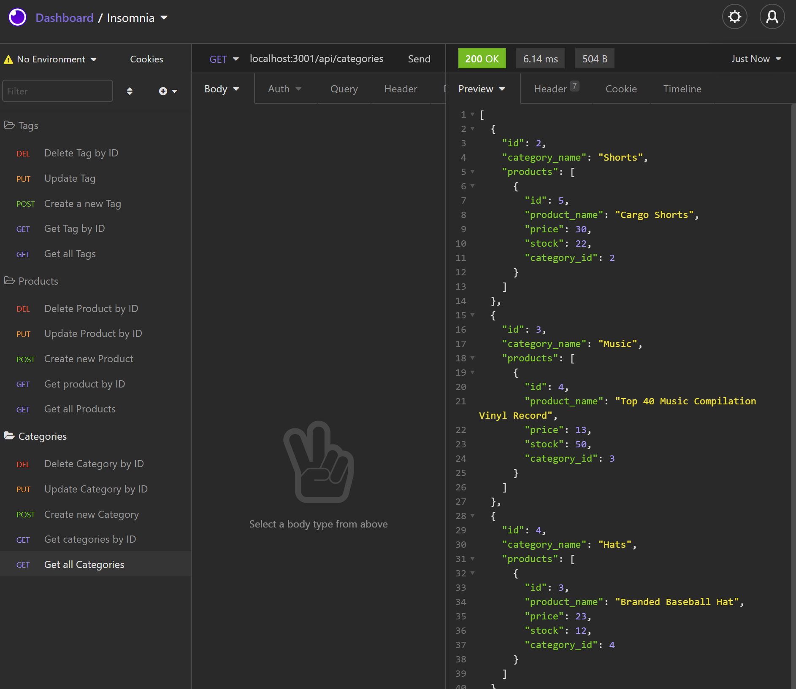

# E-Commerce Backend 
  

  
[Here is a link to the walk-through video](https://drive.google.com/file/d/1FCYHqZUdpDvJH5w-hsaiwWO633WRc6Pq/view)

[Here is a link to the gitHub repo](https://github.com/brett-treweek/Easy-E-Commerce-Back-End)  


## Description
This Project involved creating an E-Commerce Backend with Express.js, MySQL and Sequelize to query and interact with a database.

A Database is created via the MySQL Shell and is then synced to and seeded with Sequelize.

Three tables are created;
- Categories
- Products
- Tags

It utilises CRUD, the four basic operations of persistant storage, to add, view, update and delete tables and data on the database.

Insomnia is used to perform the various requests to the Express.js server as it provides an easy to use interface for interacting with HTTP-based API's.

---
## Table of Contents

- [Installation](#installation)
- [Usage](#usage)
- [License](#license)
- [Contributing](#contributing)
- [Tests](#tests)
- [Technologies](#technologies)
- [Questions](#questions)

---
## Installation  
  
Please follow these steps to install the project and any dependancies locally.

```bash
install node.js
install Insomnia
install MySQL
clone the repo from gitHub
add .env file with required information
npm install

```

---
## Usage

 
[Here is a link to a walk-through video](https://drive.google.com/file/d/1FCYHqZUdpDvJH5w-hsaiwWO633WRc6Pq/view)

- Create schema via MySQL Shell. 

- Run the app locally with the following command.   

```bash
npm start
npm run seed
```

- Use Insomnia to send Requests and View Responses.

---
## License

This project is licensed under 

---
## Contributing

Contributing to this project is not currently available.

---
## Tests

Please use these commands to perform tests.

```js

There are no tests at present.

```

---

## Technologies

- Javascript
- Node.js
- MySQL
- Sequelize
- Insomnia
- Express.js

---

## Questions

For any questions and support please contact Brett Treweek  
- Email: bretttrew@gmail.com  
- Github: [brett-treweek](https://github.com/brett-treweek)